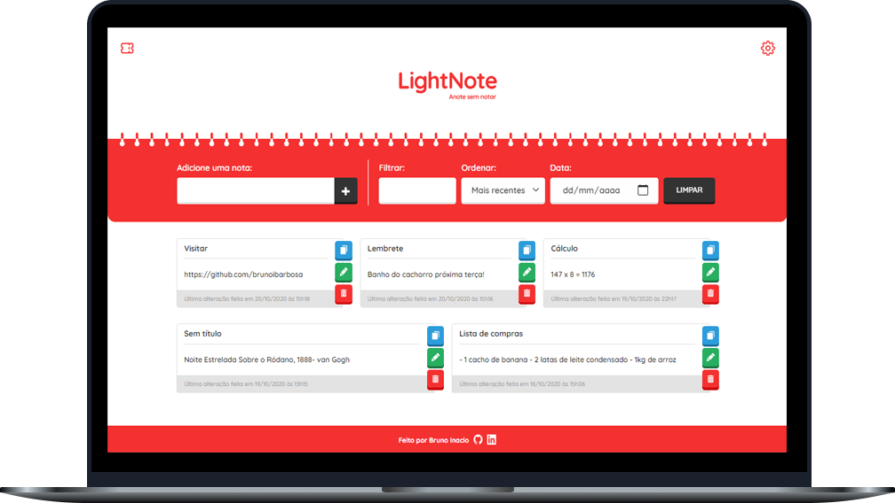

<h1 align="center">
    
</h1>

  <a href="#-tecnologias">Tecnologias</a>&nbsp;&nbsp;&nbsp;|&nbsp;&nbsp;&nbsp;
  <a href="#-projeto">Projeto</a>&nbsp;&nbsp;&nbsp;|&nbsp;&nbsp;&nbsp;
  <a href="#-layout">Layout</a>&nbsp;&nbsp;&nbsp;|&nbsp;&nbsp;&nbsp;
  <a href="#memo-licença">Licença</a>

 

  

## 🚀 Tecnologias

Esse projeto foi desenvolvido com as seguintes tecnologias:

- [Node.js](https://nodejs.org/en/)
- [Express](https://expressjs.com/pt-br/)
- [MongoDB](https://www.mongodb.com/)
- [Sass](https://sass-lang.com/)
- [Webpack](https://webpack.js.org/)

## 💻 Projeto

O LightNote é uma aplicação para quem tem pressa no dia a dia e precisa poupar o máximo de tempo. Faça anotações sem nem mesmo notar!
Acesse o site em [lightnote.tk](https://lightnote.tk/)

## 🔖 Layout

Você pode visualizar o layout inicial (mobile) do projeto através [desse link](https://www.figma.com/file/CgNH1xlUjqmDYB1IIsMVqr/LightNote). Lembrando que você precisa ter uma conta no [Figma](http://figma.com/) para acessá-lo.

## :memo: Licença

Esse projeto está sob a licença MIT. Veja o arquivo [LICENSE](LICENSE.md) para mais detalhes.
